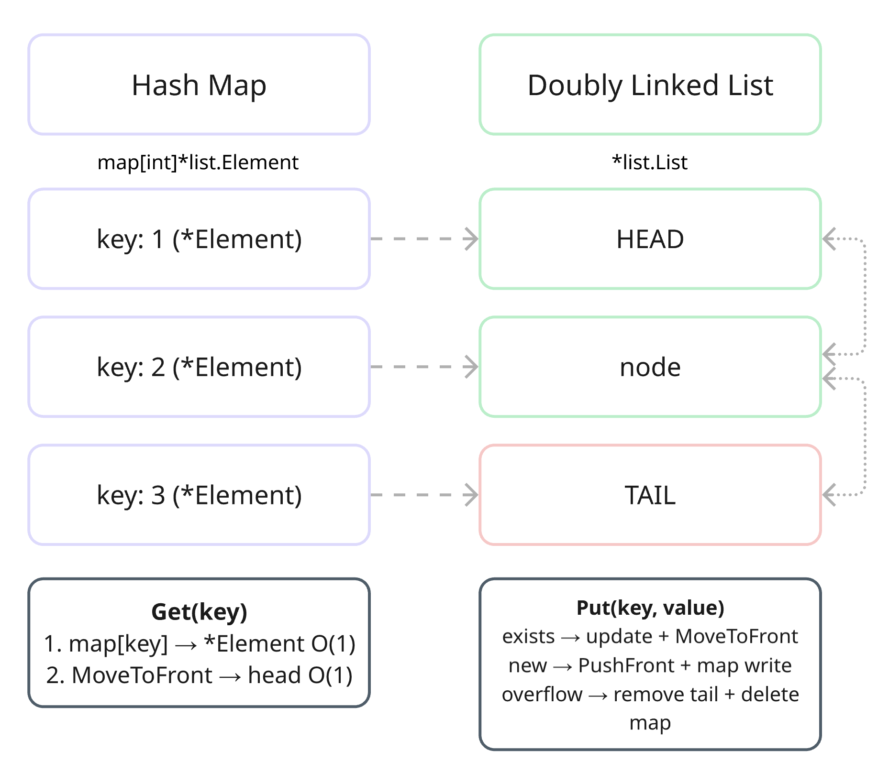

# 146 · LRU Cache

**Difficulty:** Medium | **Time:** O(1) | **Space:** O(capacity)

---

## Why HashMap alone isn't enough

When you hear "implement LRU cache", the first instinct is a map. Fast key lookup, straightforward.

But a map has no concept of recency. It doesn't know which element was used last — and therefore doesn't know who to evict when capacity is exceeded.

This is an architectural problem: you need O(1) by key and O(1) by usage order simultaneously. No single structure gives you both.

The solution — combine two.

---

## Architecture



> `map[key]*list.Element` gives instant access to a node by key.  
> The doubly linked list maintains usage order: head is most recent, tail is least recently used — first to be evicted.  
> Each node stores an `entry` struct carrying both key and value — without the key, you wouldn't know which map entry to clean up on eviction.

```go
type entry struct {
    key int
    val int
}

type LRUCache struct {
    capacity int
    list     *list.List
    items    map[int]*list.Element
}
```

---

## Get

Two steps: find the node, mark it as recently used.

Map lookup gives `*list.Element` in O(1). Then `MoveToFront` — not a copy or a shift, it's three pointer reassignments: detach the node, reattach at head. Return the value via type assertion from `Value any`.

```go
func (this *LRUCache) Get(key int) int {
    elem, ok := this.items[key]
    if !ok {
        return -1
    }
    this.list.MoveToFront(elem)
    return elem.Value.(entry).val
}
```

## Put

Two cases, then one shared eviction check.

If the key already exists — update value in-place, move to front. No new allocations, no map writes.  
If the key is new — `PushFront` creates a node at head and returns `*list.Element`, which we store in the map. This is the link between both structures.

After insertion, check capacity. If exceeded — `Back()` returns the tail node (LRU). Extract its key from the embedded `entry`, delete from map, remove from list. Both structures stay in sync.

```go
func (this *LRUCache) Put(key int, value int) {
    if elem, ok := this.items[key]; ok {
        elem.Value = entry{key, value}
        this.list.MoveToFront(elem)
    } else {
        this.items[key] = this.list.PushFront(entry{key, value})
    }

    if len(this.items) > this.capacity {
        back := this.list.Back()
        if back != nil {
            delete(this.items, back.Value.(entry).key)
            this.list.Remove(back)
        }
    }
}
```

---

## stdlib notes

- `container/list` — Go standard doubly linked list with built-in sentinel nodes. No nil edge cases on empty list.
- `list.Element` — holds `Value any` and `prev/next` pointers. The map stores a pointer to it — this is what connects both structures.
- `MoveToFront` — detaches a node and reattaches at head via pointer reassignment. O(1), no data copied.
- `PushFront` — allocates a new node at head, returns `*list.Element`. Store the result in the map immediately.

> *LRU without a doubly linked list means O(n) eviction. It will silently kill performance at scale.*
> 